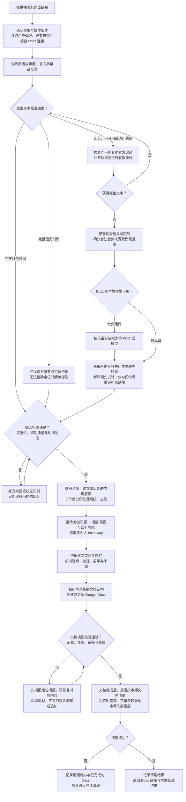

# Podcast Study · 播客精读

把播客或访谈的标题、链接整理成有理解深度、能回听的 Google Docs 笔记。

完整原生字幕优先；确实无法获取时才下载音频，用 Buzz 和本地模型转录。文档完成并读回核验之后，最后才把本期产生的音频、字幕和转录副本移入系统废纸篓。

这是一个可调用的 Codex 技能，附带工作流、默认设置和空白任务模板。它需要当前环境提供浏览器、文件工具和 Google Docs 写入连接；安装技能本身不会部署后台服务、登录 Google 或自动下载模型。

## 工作流程



- 已完成且无需更新的单集直接返回已有文档；中断任务从未完成阶段恢复，修改旧笔记时从现有 Docs 开始。
- 访问失败不等于没有字幕；完整文本缺少时间戳，也不会因此重新转录整期。
- 任一阶段受阻时保存进度并说明限制；文档未完成或重要核验未通过时保留素材。清理只涉及本期临时文件，保留 Buzz、本地模型及用户原有素材，不永久删除或清空废纸篓。

## 默认文档

1. **个人 takeaway**：本期对自己意味着什么、依据和可执行动作。
2. **一句话主线 + 思维导图**：核心内容与重点段落导航；连接正文解释和对应播放器时间位置。
3. **把关键问题讲明白**：回答、推理、案例、前提与适用条件。
4. **来源与必要说明**：只保留确有必要的出处和限制。

开头不放发布日期、整理日期和处理工具等元数据。导图节点不能直接点击时，用导图和同编号链接表；播放器不支持精确跳转时明确提供节目链接与时间。

这是默认值，用户可以更改。完整规则在 [默认文档结构](skills/podcast-study/references/document-format.md)。

## 安装与调用

可以直接把下面的话发给 Codex：

> 请从 https://github.com/5Hongjian/podcast-study 安装 skills/podcast-study。保留我已有的个人偏好、文档结构覆盖和单期任务记录。

也可以在本机使用 Python 3.10+ 和 Git：

```sh
git clone https://github.com/5Hongjian/podcast-study.git
cd podcast-study
python3 scripts/install.py
```

安装器默认使用 `~/.agents/skills/podcast-study`。如果这里已有指向旧安装的符号链接，会保留链接并更新其目标；也可用 `--skills-dir` 指定位置。Codex 的用户级技能目录见 [官方技能文档](https://learn.chatgpt.com/docs/build-skills)。如果技能未出现，重启 Codex。

调用示例：

> 使用 $podcast-study 整理这个播客：〈标题或链接〉。完成 Google Docs 并核验后，再清理本期临时音频和转录文件。

新用户只有在确实需要本地转录时，才按 [Buzz 安装指引](skills/podcast-study/references/buzz-setup.md) 检查设备、安装缺少的 Buzz 与合适模型。已有完整字幕时不下载这些组件。

## 检查

```sh
python3 scripts/validate.py
python3 -m unittest discover -s tests -v
```

自动检查覆盖发布文件、空白模板及安装升级的数据保留。字幕判断、内容解释和 Google Docs 实际呈现仍需按 [行为评估场景](docs/evaluation-cases.md) 验证，不能用静态检查冒充端到端运行成功。
