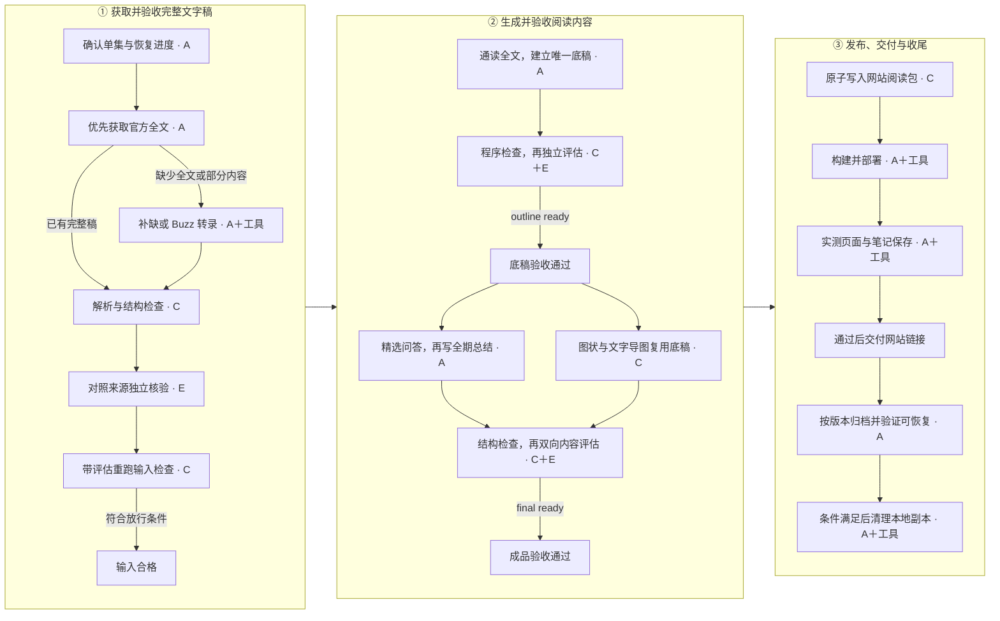

# 播客精读工作流程

[返回项目首页](../README.md) · [当前版本](../VERSION)

从左到右看三个阶段，每列内部从上到下读。主图只保留正常路线，失败回退见下表。

**A：执行 Agent；E：独立评估；C：固定代码。** Agent 调用工具并推进流程；代码检查结构、引用与版本，不能证明语义或音频听写正确。随附脚本不提供下载、转录或无人值守调度服务。

## 放行条件

| 关口 | 允许继续的条件 |
|---|---|
| 输入合格 | `ready`；或 `ready_with_limitations` 且限制符合本次用途。`blocked` / `needs_review` 不进入生成；ASR 忠实度须有音频或可信人工参考依据 |
| 底稿通过 | 程序结构合法；独立通读全文后，忠实度、覆盖、结构三项通过，重要观点有节点承接；评估绑定当前底稿与源包，重跑为 `outline ready` |
| 成品通过 | 六项硬标准全部通过、四项阅读评分各 ≥2/3，无未解决重要问题；当前底稿评估仍有效，重跑为 `final ready` |
| 网站交付 | 构建与数据检查通过、部署版本明确；实际页面与笔记保存核验通过，无重要内容或导航错误。仅写入本地阅读包不等于网站上线 |
| 允许清理 | 网站已核验交付；完整结构化原文、内容、有效评估、引用与笔记按版本持久保存；验证无需本地导出稿也能恢复相同发布包，准确文件清单已核对 |

## 失败回退

| 问题 | 处理位置 |
|---|---|
| 原文缺失、错误或时间不可靠 | 修对应来源、片段或时间映射，重新输入验收 |
| 底稿遗漏、层级错误或节点依据不足 | 修底稿，重新验收底稿与成品 |
| 仅总结、问答或正文专用引用有问题 | 修对应内容，重做结构与成品验收；未受影响的新式底稿评估可复用 |
| 部署或页面交互故障 | 修对应发布或页面环节；语义问题退回内容，原文问题退回输入。发布结果不明确时先查已有部署 |
| 归档不完整或不能恢复 | 保留本地素材，补齐归档与恢复验证 |
| 清理失败 | 保留 `cleanup_pending`，只续接清理；不撤回网站交付，不重新生成或发布 |

输入和内容均最多两轮有依据的局部修复，仍不达标则保留材料与原因；不能只换哈希继承旧评估。节点、节点依据、覆盖或来源改变时，两阶段内容评估都须重新进行。详细条件以 [输入规则](../skills/podcast-study/references/input-quality.md)、[内容评价标准](../skills/podcast-study/references/content-quality.md) 为准。

## 恢复与阅读

- 已完成且无更新要求时直接复用；中断从未完成阶段续接。继续生成或发布前重跑当前产物的对应检查，不以旧运行记录中的通过状态放行。
- 完整无时间稿可按原句定位，不仅为缺时间而重转整期；要求精确回听时仍须解决时间核验。访问失败不等于确定没有字幕，先有限重试或核对其他官方来源。
- 每次发布都做 [必要页面实测](../skills/podcast-study/references/content-quality.md#页面核验范围)。仅在组件、配置及内容边界符合已验收基线时复用完整交互回归；首次、代码变化或范围不明时完整回归，超界追加相关测试。没有浏览器证据不能写页面通过。
- 网站阅读顺序固定为全文总结 → 思维导图 → 相关问答 → 我的思考。问答精选不减免主要主题与重要条件的覆盖；图状和文字大纲使用同一 `nodes`。个人笔记独立保存，详见 [网站内容规范](../skills/podcast-study/references/document-format.md)。
- 网站通过即可交付，清理随后完成。按 [任务恢复与清理规则](../skills/podcast-study/references/task-state.md) 仅将合格的本次导出稿和临时副本移入系统废纸篓；唯一全文、评估、发布数据与笔记继续保留。
