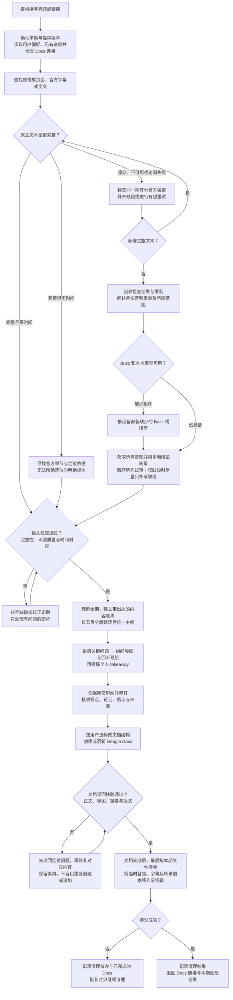

# 播客精读工作流程

[返回项目首页](../README.md)

- 已完成且无需更新的单集直接返回已有文档；中断任务从未完成阶段恢复，修改旧笔记时从现有 Docs 开始。
- 访问失败不等于没有字幕；完整文本缺少时间戳，也不会因此重新转录整期。
- 任一阶段受阻时保存进度并说明限制；文档未完成或重要核验未通过时保留素材。清理只涉及本期临时文件，保留 Buzz、本地模型及用户原有素材，不永久删除或清空废纸篓。
